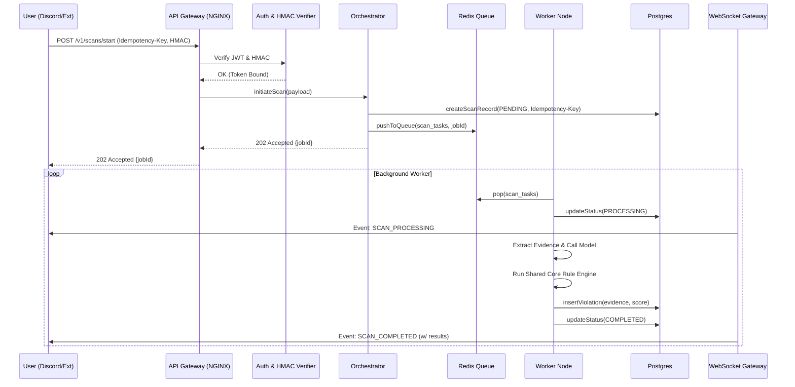

# 01 - Architecture & Security (Lutheus CezaRapor v3.1)

## 1. Final v3.1 System Architecture (Mermaid)

```mermaid
graph TD
    subgraph Hostile Client Environments
        EXT[Browser Extension v3.1]
        DBOT[Discord Bot UI]
    end

    subgraph Security Perimeter
        CDN[Cloudflare CDN & WAF]
        NGINX[API Gateway / mTLS Termination]
    end

    subgraph Core Platform Services
        API[NestJS REST API]
        WS[WebSocket Sync Gateway]
        AUTH[Identity & Access Proxy]
    end

    subgraph Orchestration & Workers
        SAGA[Scan Orchestrator - Saga Pattern]
        WORKER[Analysis Workers - Bulkhead Isolated]
        AI[Model Inference Proxy]
    end

    subgraph Shared Domain Core (TypeScript)
        CORE[Rule Engine & Confidence Calibration]
    end

    subgraph Persistence & State
        PG[(PostgreSQL Primary - HA)]
        PG_RO[(PostgreSQL Replica - Read Only)]
        REDIS[(Redis Cluster - Queue/Cache)]
        WAL[(Write-Ahead Log / Object Storage)]
    end

    EXT -- HMAC + JWT over TLS --> CDN
    DBOT -- HMAC + JWT over TLS --> CDN
    CDN --> NGINX
    
    NGINX --> API
    NGINX --> WS
    NGINX --> AUTH
    
    API -- Enforced Correlation ID --> SAGA
    SAGA -- Queue Task --> REDIS
    REDIS -- Consume --> WORKER
    
    WORKER --> CORE
    WORKER --> AI
    
    API --> PG
    WORKER --> PG
    API -.-> PG_RO
    
    SAGA --> WAL
```

## 2. Threat Model v2 (STRIDE + LINDDUN)

| Tehdit | Sınıflandırma | STRIDE / LINDDUN | Mitigasyon (Enterprise-Grade) |
| :--- | :--- | :--- | :--- |
| **S**poofing | Kimlik Sahteciliği | STRIDE | Client Fingerprinting, Token Binding (JWT ↔ Device Hash), mTLS. |
| **T**ampering | Veri Değiştirme | STRIDE | İstemci tarafında Checksum / Integrity Verification. Append-only DB (Event Sourcing). |
| **R**epudiation | İnkar | STRIDE | WORM (Write Once Read Many) Audit Logları. Tüm DB state değişimlerinde Actor ID zorunluluğu. |
| **I**nformation DB | Veri Sızıntısı | STRIDE | Field-Level Encryption (PII için). Object-Level Authorization (OOE). Redaksiyon Proxy'si. |
| **D**enial | Servis Kesintisi | STRIDE | Token Bucket Rate Limit. Redis/DB Bulkhead İzolasyonu. WAF Layer 7 DDoS koruması. |
| **E**levation | Yetki Yükseltme | STRIDE | Strict RBAC Schema. Discord Rol ↔ Sistem Rol eşleşmesinde hiyerarşik imza mekanizması. |
| **L**inkability | Veri Birleştirme | LINDDUN | Kullanıcı kimlikleri ile tarama logları arasında kısıtlı bağ. Discord ID'leri hashlenerek saklanır. |
| **I**dentifiability | Kimlik Tespiti | LINDDUN | PII maskeleme. Yönetici erişimi dışında gerçek kimliklerin gösterilmemesi (UUID kullanımı). |
| **N**on-Repudiation| İşlem İnkarı | LINDDUN | Log bütünlüğü için kriptografik hash chain. |
| **D**etectability | Tespit Edilebilirlik | LINDDUN | Veri analiz trafiğinin normal network akışına (TLS) karıştırılması/jitter eklenmesi. |
| **D**isclosure | Bilgi İfşası | LINDDUN | Hassas alanların DB'de AES-256 GCM ile şifrelenmesi. (Örn: Evidence Data). |
| **U**nawareness | Kullanıcı Habersizliği| LINDDUN | Aktif taramalarda Bot üzerinden kanalda transparan loglama politikası. |
| **N**on-Compliance| Uyum Gösterilmeme | LINDDUN | Otomatik Data Retention (30 Gün TTL) ve Forget Me fonksiyonları. |

## 3. End-to-End Sequence Diagrams (Scan Lifecycle)



## 4. Dependency Risk Analysis

| Bağımlılık | Kritiklik | Risk Sınıfı | Mitigasyon Planı |
| :--- | :--- | :--- | :--- |
| **Discord.js** | Çok Yüksek | Third-Party API Değişimi | Adapter Pattern kullanımı. Discord API v10/v11 değişimleri sadece gateway interface'ini etkiler. Core domain izole edilir. |
| **NestJS** | Yüksek | Framework Lock-in | Clean Architecture. Controller/Service katmanları ince tutulur. Domain logic düz TypeScript class'larında (Shared Core) tutulur. |
| **PostgreSQL** | Kritik | Single Point of Failure | HA (High Availability) Cluster. Primary/Standby mimarisi ile anlık failover yönetimi. |
| **npm Paketleri** | Orta | Supply Chain Attack | `pnpm audit` entegre CI/CD. Dependabot/Renovatebot konfigürasyonu. Üretim ortamına sadece kilitlenmiş (lockfile) bağımlılıklar çıkar. |

## 5. 12-Month Scalability Roadmap

### Q1: Stabilizasyon ve İzolasyon (Ay 1-3)
- Tüm Worker'ların ana API monolitinden ayrılarak mikroservis tarzında bağımsız Kubernetes pod'larına taşınması.
- WAF (Cloudflare/AWS Shield) devreye alınması ve strict rate-limiting politikalarının aktivasyonu.
- Redis bazlı token bucket rate-limiting implementasyonu.

### Q2: Veri Dağılımı ve Event-Driven Dönüşüm (Ay 4-6)
- PostgreSQL için Master-Replica yapısının oturulması. Sadece okuma yapan işlemlerin (Dashboard raporları vb.) Read Replica'ya yönlendirilmesi (CQRS temelleri).
- Uzun süren taramaların Redis kuyruklarından Kafka (veya RabbitMQ) gibi kalıcı bir event-streaming platformuna aktarımı.

### Q3: ML Destekli Zeka Mimarisi (Ay 7-9)
- Karar motoruna (Decision Engine) pluggable Python/gRPC inferans katmanının eklenmesi.
- Drift Detection (Veri kayması denetimi) sisteminin oluşturulması: Sistem güven skorlarının zaman içindeki istikrarının SRE dashboardlarına entegrasyonu.

### Q4: Global Edge & Resilience (Ay 10-12)
- Uzantıdan gelen doğrulamaların ve basit payload işleme adımlarının Edge Functions (Cloudflare Workers / Vercel Edge) tarafında yapılması.
- Gerçek Chaos Engineering testlerinin yapılarak (Chaos Mesh kullanılarak) üretim benzeri ortamda sistemin kendini iyileştirme tepkisinin ölçümü.
